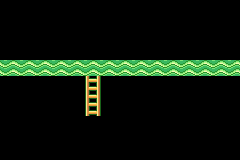
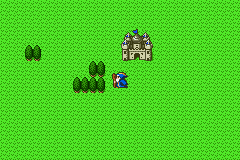
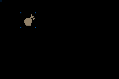

This repo just holds a bunch of my GBA demo programs. I just be doin' some
GBAz. Toncin' away.

### first
Just a cool demo that copies the key register and paints it across the whole
screen for psychadelic colours.

### map
Simple tile map demo. Tiles pulled from Super Mario Bros. 2 for GBA.

### rpgmap
Combination of a simple map and an object in the center of the screen. Similar
to your typical RPG. Sprites ripped from Dragon Warrior for SNES. L/R to switch
characters. D-Pad to move.

### sprite
Simple sprite demo

### spriter
Simple sprite demo take #2

### sprites
Simple sprite demo with 3 different sprites. Sprites ripped from Dragon Warrior
 for SNES. L/R to switch sprite. D-Pad to move. A to disable sprite.

### template
Simple template.

### xor
Unfinished X's and O's
